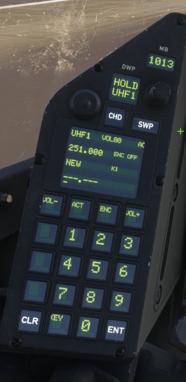

# IFE Eurofighter SRS MOD — v1.1m4

**By Verbal81 · MSFS 2024 · IFE Eurofighter · SRS**

## [⬇ ZIP HERUNTERLADEN](https://github.com/Verbal81/IFE-Eurofighter-SRS-MOD/archive/refs/heads/main.zip)

## [📖 PDF-ANLEITUNG: INSTALLATION UND BEDIENUNG](IFE_Eurofighter_SRS_MOD_Anleitung.pdf)

Die fünfseitige Anleitung enthält Erstinstallation, Update, Desktop-Verknüpfung, täglichen Start, Cockpitbedienung und Wiederherstellung. Sie liegt auch direkt im ZIP. Auf der PDF-Seite bei Bedarf **Download raw file** wählen.

**Neu installieren:** `1_EINMALIG_EINRICHTEN.cmd`  
**Zum Fliegen:** Desktop-Verknuepfung **SRS-Mod starten**  
**Bereits installiert / Update:** `3_EINSTELLUNGEN_UND_DEINSTALLATION.cmd` → **Desktop-Verknuepfung erstellen**

Das ZIP zuerst vollstaendig entpacken. Kurzanleitung: [0_LIES_MICH.txt](0_LIES_MICH.txt).

## Wichtiger Hinweis / Important Notice

**DE:** Dies ist eine inoffizielle Drittanbieter-Modifikation und steht in keiner Verbindung zu IndiaFoxtEcho bzw. wird nicht von IndiaFoxtEcho unterstützt. Dieser Mod enthält oder verbreitet keine vollständigen originalen IndiaFoxtEcho-Flugzeugdateien. Sämtliche erforderlichen Änderungen werden ausschließlich lokal an der beim Benutzer installierten Eurofighter-Version vorgenommen. IndiaFoxtEcho ist für diese Modifikation nicht verantwortlich und übernimmt keinen Support dafür. Support für diesen Mod erfolgt ausschließlich durch den Mod-Autor.

**EN:** This is an unofficial third-party modification and is not affiliated with or endorsed by IndiaFoxtEcho. This mod does not contain or redistribute complete original IndiaFoxtEcho aircraft files. All required modifications are generated and applied locally to the user's installed Eurofighter files. IndiaFoxtEcho is not responsible for this modification and does not provide support for it. Support for this mod is provided solely by the mod author.

Integration of DCS SimpleRadio Standalone (SRS) with the IndiaFoxtEcho Eurofighter in Microsoft Flight Simulator 2024.

## Cockpit-Vorschau

UHF-Frequenz, ACT, ENC/KEY und Lautstärke direkt im Cockpit. Zum Vergrößern auf das Bild klicken.

## Antivirus verification / Security note

The v1.1m3 release package was submitted to the Avira Virus Lab for analysis.

Avira classified the submitted files as **Clean**.

The application is not commercially code-signed, so Windows or other antivirus products may still show reputation-based warnings.

This independent malware analysis is provided as an additional transparency measure.

Users should never disable their antivirus software to install the MOD.

## Compatibility
- Microsoft Flight Simulator 2024
- IndiaFoxtEcho Eurofighter 1.0.9 und 1.0.10 (geprüfte XML-Dateistände; Erkennung über Prüfsummen)
- DCS SimpleRadio Standalone 2.4.1.0
- Windows PowerShell 5.1, 64-bit

## Kompatibilität mit 1.0.9 / 1.0.10

Der Installer erkennt den passenden Patch anhand aller drei XML-Dateien, unabhängig von der Versionsnummer im Paketmanifest. Der Inhalt außerhalb der 21 betroffenen Modelldatei-Tastenfunktionen bleibt erhalten. Die Wiederherstellung verwendet die zum Profil passende Original-Sicherung. Unbekannte Dateistände werden weiterhin geschützt abgelehnt.

**Neuer 1.0.9-Teststand:** Die drei XML-Ausgabedateien sind offline geprüft. Installation, Funkbetrieb und Wiederherstellung unter Windows müssen für 1.0.9 noch praktisch getestet werden. Die bestehende 1.0.10-Funklogik bleibt unverändert.

## Welche Datei starten?

ZIP **vollstaendig entpacken** und den gesamten Ordner dauerhaft behalten.
Die internen Dateien unter `Programm` nicht einzeln starten.

| Dein Ziel | Hier doppelklicken |
|---|---|
| Zum ersten Mal installieren | **`1_EINMALIG_EINRICHTEN.cmd`** |
| Taeglich fliegen | **SRS-Mod starten** auf dem Desktop oder **`2_SRS_MOD_STARTEN.cmd`** |
| Einstellungen, Pfade, Pruefung oder Deinstallation | **`3_EINSTELLUNGEN_UND_DEINSTALLATION.cmd`** |
| Kurze Anleitung lesen | **`0_LIES_MICH.txt`** |

### Erstinstallation

MSFS und SRS schliessen, dann **`1_EINMALIG_EINRICHTEN.cmd`** starten.
Bei Bedarf Eurofighter-Ordner und SRS-CLIENT-Ordner auswaehlen.
Im CLIENT-Ordner muss `SR-ClientRadio.exe` direkt liegen.
Nach erfolgreicher Einrichtung wird die Desktop-Verknuepfung angelegt;
SRS und Bridge werden ebenfalls gestartet. Bereitschaftsmeldung abwarten,
SRS verbinden, dann MSFS starten.

### Bereits installiert? Dieses Update einrichten

**`3_EINSTELLUNGEN_UND_DEINSTALLATION.cmd`** starten und
**Desktop-Verknuepfung erstellen** waehlen. Die eigene bestehende Verknuepfung
wird auf den neuen Mod-Ordner aktualisiert. Eine erneute Installation des
Flugzeugpatches ist nicht erforderlich. Danach den neuen Ordner behalten.

### Desktop-Verknüpfung: „SRS-Mod starten“

Die Erstinstallation erstellt diese Verknüpfung automatisch auf dem Desktop.
Falls sie fehlt oder du ein Update entpackt hast:
**`3_EINSTELLUNGEN_UND_DEINSTALLATION.cmd`** starten → **Desktop-Verknuepfung erstellen**.

**Nach jedem PC-Neustart vor dem Fliegen auf „SRS-Mod starten“ doppelklicken.**
Damit starten SRS und Bridge gemeinsam, ohne Einrichtungsmenü.
Die Bereitschaftsmeldung abwarten, SRS verbinden und danach MSFS starten.

**Wichtig:** Nur die Verknüpfung liegt auf dem Desktop. Den gesamten entpackten
Mod-Ordner inklusive `Programm` behalten. Nicht nur eine CMD-Datei auf den
Desktop verschieben – sie benötigt die Dateien im Mod-Ordner.

### Taeglicher Start

1. MSFS und SRS schliessen.
2. **SRS-Mod starten** auf dem Desktop doppelklicken
   (alternativ **`2_SRS_MOD_STARTEN.cmd`**).
3. Bereitschaftsmeldung abwarten.
4. SRS verbinden, danach MSFS starten.

**SRS und Bridge werden gemeinsam gestartet.** Das normale Oeffnen von SRS
startet die Bridge nicht. Nach einem PC-Neustart oder nach dem Beenden von
SRS/Bridge den Direktstart wieder nutzen. Die Flugzeugaenderungen bleiben
installiert; der Direktstart veraendert keine Flugzeugdateien.
Es wird kein Windows-Autostart eingerichtet.

**EN:** Fully extract and keep the entire folder. First-time installation:
`1_EINMALIG_EINRICHTEN.cmd`. Daily start: the **SRS-Mod starten** desktop
shortcut or `2_SRS_MOD_STARTEN.cmd`. Settings and uninstall:
`3_EINSTELLUNGEN_UND_DEINSTALLATION.cmd`. Existing users should open settings
and select **Desktop-Verknuepfung erstellen** to update the shortcut without
reinstalling the aircraft patch. Close MSFS and SRS before starting; wait for
the ready message, connect SRS, then start MSFS. Starting ordinary SRS alone
does not start the bridge. Internal files are in `Programm`.

**Teststatus (8. Oktober 2026):** Die neue nutzerfreundliche Ausgabe wurde vom Autor unter Windows erfolgreich getestet und als funktionierend bestaetigt. Das ist ein Funktionstest auf seinem Rechner, keine Garantie fuer jede Systemkonfiguration.

The installer verifies the supported aircraft state before writing anything. It creates a local verified backup and uses transactional replacement with rollback.

The mod does not ship Microsoft SimConnect DLLs. It uses `SimConnect_internal.dll` from the user's own installed Microsoft Flight Simulator 2024 copy.

## Deinstallation / Uninstall
MSFS und SRS schliessen, `3_EINSTELLUNGEN_UND_DEINSTALLATION.cmd` starten und **Mod deinstallieren / Flugzeug wiederherstellen** waehlen.

The uninstaller restores the three supported IFE XML files and `layout.json` from a verified local original backup and verifies the restored hashes. Unknown third-party file states cause a safe abort instead of being overwritten.

## Validated release path
The complete release cycle was successfully verified:

**IFE original state → clean installation → SRS/Bridge startup → MSFS 2024 cockpit/SRS operation → uninstall → verified IFE original state**

Validated functions include UHF1/UHF2, frequency synchronization, volume, active radio, ENC/HOLD and SRS synchronization.

No v1.1m3 runtime is required and no MSFS SDK installation is required.

## License / Lizenz

**By Verbal (GitHub: Verbal81).**

**DE:** Für Veröffentlichungen unter der neuen [Lizenz](LICENSE) ab dem
8. Oktober 2026 sind private, nichtkommerzielle Nutzung und private Änderungen
kostenlos erlaubt, einschließlich nichtkommerzieller Multiplayer-Sitzungen.
Verkauf, kommerzielle Nutzung, Weiterverbreitung (auch kostenlos) und
Veröffentlichung veränderter Versionen benötigen vorherige schriftliche
Erlaubnis. Links zum offiziellen Repository dürfen geteilt werden.
Dies ist eine eigene Lizenz mit einsehbarem Quellcode, keine Open-Source-Lizenz.
Rechte an zuvor gültig unter MIT veröffentlichten Kopien bleiben bestehen;
die neue Lizenz untersagt deren zuvor erlaubten Verkauf nicht rückwirkend.
Für Fremdmaterial gelten dessen eigene Bedingungen; siehe
[THIRD_PARTY_NOTICE.txt](THIRD_PARTY_NOTICE.txt). Maßgeblich ist der vollständige
englische Lizenztext.

**EN:** Distributions under the new [license](LICENSE) from 8 October 2026
permit free private, non-commercial use and private modifications, including
non-commercial multiplayer simulator sessions. Sale, commercial use,
redistribution (including free redistribution), and publication of modified
versions require prior written permission. Sharing links to the official
repository is allowed. This is a custom source-available license, not an
open-source license. Previously valid MIT permissions remain intact; this
change does not retroactively prohibit sale of earlier MIT-licensed copies.
Third-party material remains governed by its own terms. See
[THIRD_PARTY_NOTICE.txt](THIRD_PARTY_NOTICE.txt) and the full license for details.

### Kopierkorrektur vom 09.10.2026

Die Einrichtung kopiert Sicherungen und temporaere Dateien als Dateiinhalt, ohne die EFS-Verschluesselungsattribute der Quelle zu uebertragen. Neue Dateien erben den Schutz ihres Zielordners; die Originaldateien werden nicht pauschal entschluesselt und Windows-Berechtigungen werden nicht geaendert. SHA-256-Pruefung, atomarer Austausch und Wiederherstellung bleiben erhalten. Kopierfehler nennen jetzt Quelle und Ziel. Die Korrektur ist noch nicht auf dem betroffenen Windows-PC bestaetigt.

Bei der bisherigen Meldung „Die angegebene Datei konnte nicht verschluesselt werden“: aktuelles ZIP in einen neuen dauerhaften Ordner entpacken, MSFS und SRS schliessen und `1_EINMALIG_EINRICHTEN.cmd` erneut ausfuehren. Keine vorherige Deinstallation erforderlich. Ein `EPERM`-Fehler des separaten VFR-Charts-Installers ist damit nicht behoben.
